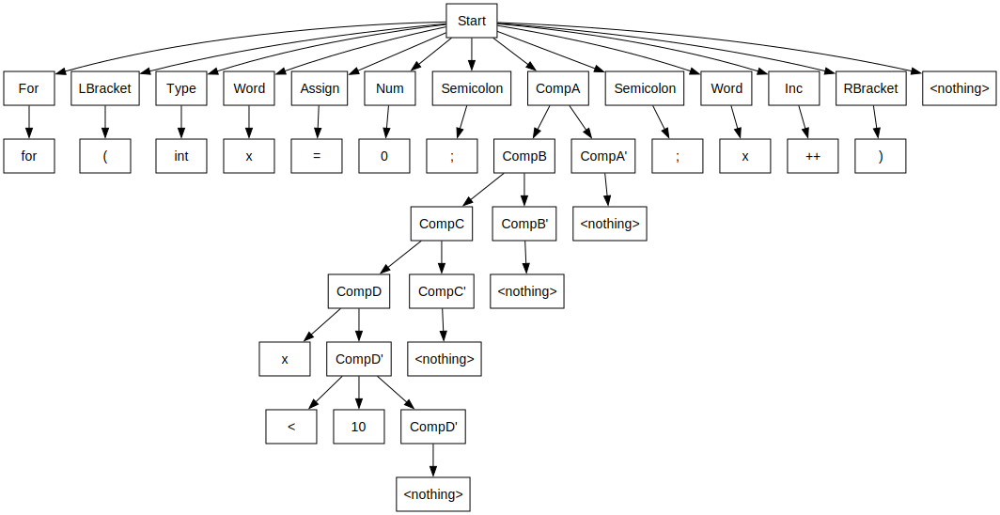
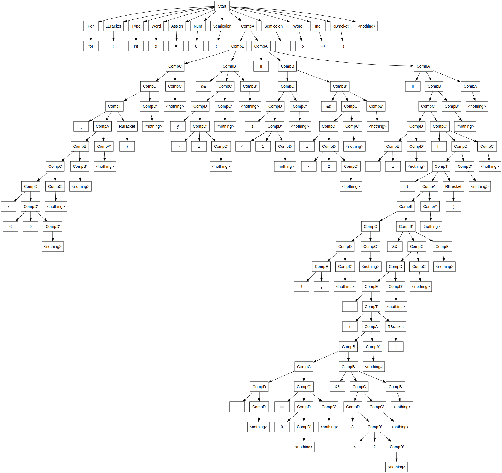

## Грамматика

### КСГ
```
Start     -> For LBracket Type Word Assign Num Semicolon CompA Semicolon Word Inc RBracket
Type      -> "int"
Type      -> "char"
Type      -> "long"
Word      -> word
Num       -> number

CompA     -> CompB CompA'
CompA'    -> "||" CompB CompA'
CompA'    -> eps

CompB     -> CompC CompB'
CompB'    -> "&&" CompC CompB'
CompB'    -> eps

CompC     -> CompD CompC'
CompC'    -> "==" CompD CompC'
CompC'    -> "!=" CompD CompC'
CompC'    -> eps

CompD     -> CompE CompD'
CompD'    -> "<=" CompE CompD'
CompD'    -> "<" CompE CompD'
CompD'    -> ">=" CompE CompD'
CompD'    -> ">" CompE CompD' 
CompD'    -> eps

CompE     -> "!" CompE
CompE     -> CompT

CompT     -> "(" CompA ")"
CompT     -> Num
CompT     -> Word

Inc       -> "++"
Inc       -> "--"
For       -> "for"
LBracket  -> "("
RBracket  -> ")"
Assign    -> "="
Semicolon -> ";"
```

Правого ветвления нет
А левую рекурсию я сразу удалял в процессе построения

### FIRST, FOLLOW

| Нетерминал | FIRST                  | FOLLOW                                          |
|----------|------------------------|-------------------------------------------------|
| Start    | for                    | $                                               |
| Type     | int, char, long        | *word*                                          |
| Word     | *word*                 | \|\|, &&, ==, !=, <=, <, >=, >, ), ++, --, =, ; |
| Num	     | *number*               | \|\|, &&, ==, !=, <=, <, >=, >, ), ;            |
| CompA    | *word*, *number*, !, ( | ), ;                                            |
| CompA'   | \|\|, *eps*            | ), ;                                            |
| CompB    | *word*, *number*, !, ( | ), ;, \|\|                                      |
| CompB'   | &&, *eps*              | ), ;, \|\|                                      |
| CompC    | *word*, *number*, !, ( | ), ;, \|\|, &&                                  |
| CompC'    | ==, !=, *eps*          | ), ;, \|\|, &&                                  |
| CompD    | *word*, *number*, !, ( | ), ;, \|\|, &&, ==, !=                          |
| CompD'    | <=, <, >=, >, *eps*    | ), ;, \|\|, &&, ==, !=                          |
| CompE    | *word*, *number*, !, ( | ), ;, \|\|, &&, ==, !=, <=, <, >=, >            |
| CompT    | *word*, *number*, (    | ), ;, \|\|, &&, ==, !=, <=, <, >=, >            |
| Inc	     | ++, --                 | )                                               |
| For	     | for                    | (                                               |
| LBracket | (                      | int, char, long                                 |
| RBracket | )                      | $                                               |
| Assign	  | =                      | *number*                                        |
| Semicolon | ;                      | *word*, *number*, !, )                          |


## Пример

`for (int x = 0; x < 10; x++)`



## Пример модификации

`for(int x=0;(x<0)&&y>z||z<=1&&z>=2||!z!=(!y&&!(1==0&&3<2));x++)`

